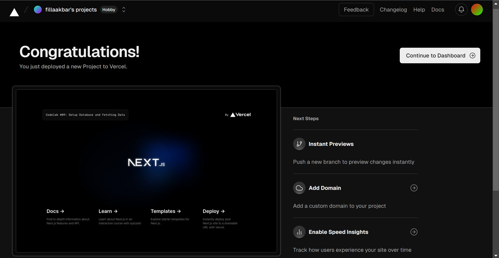
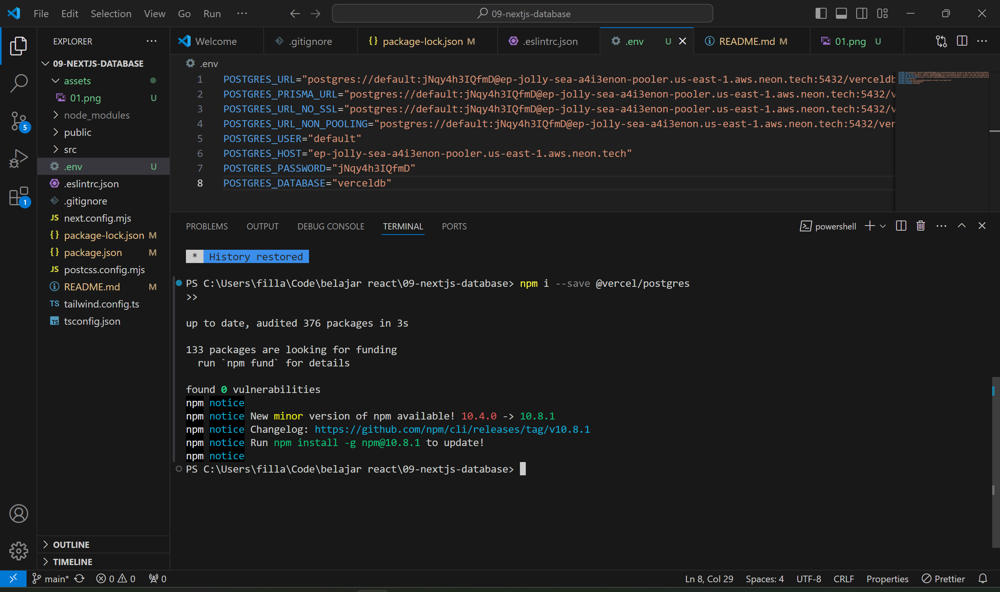
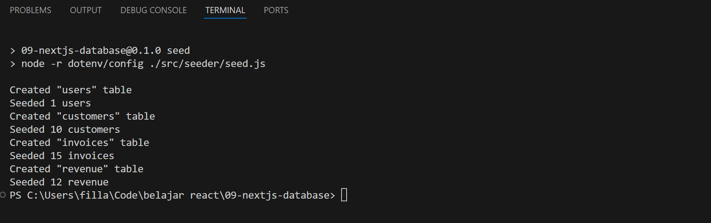
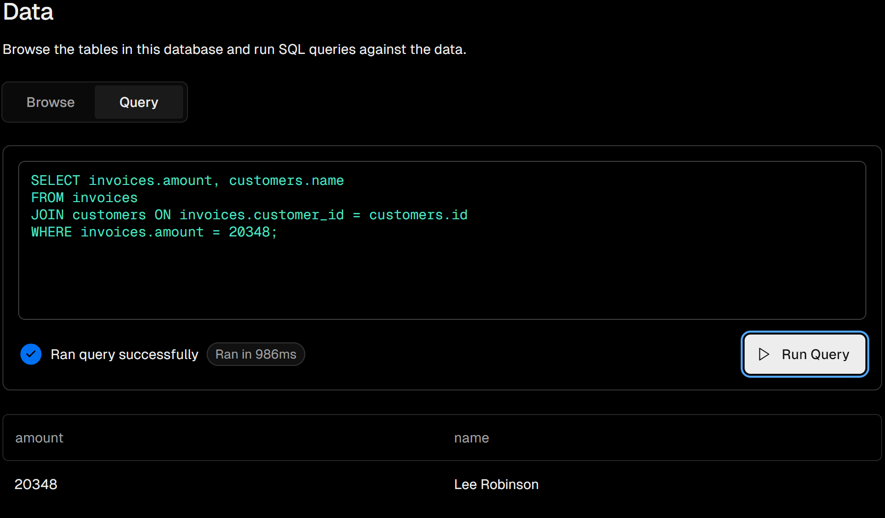
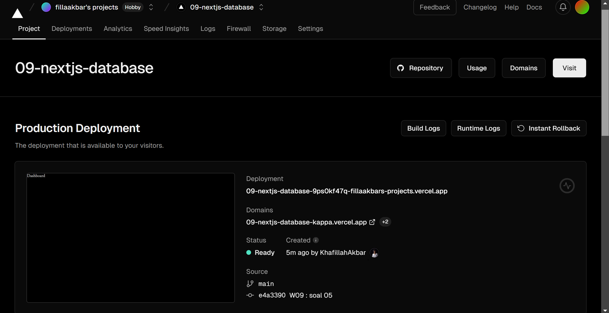
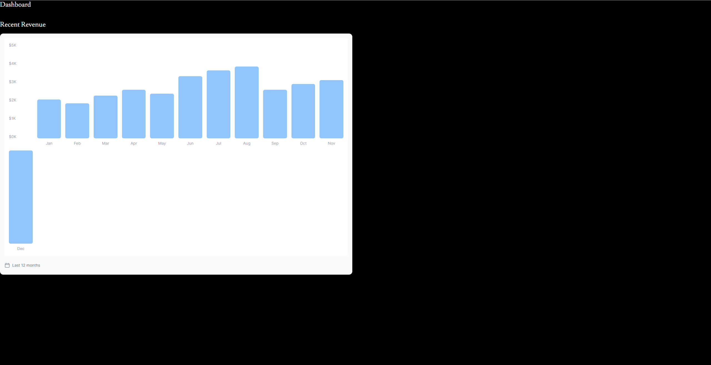
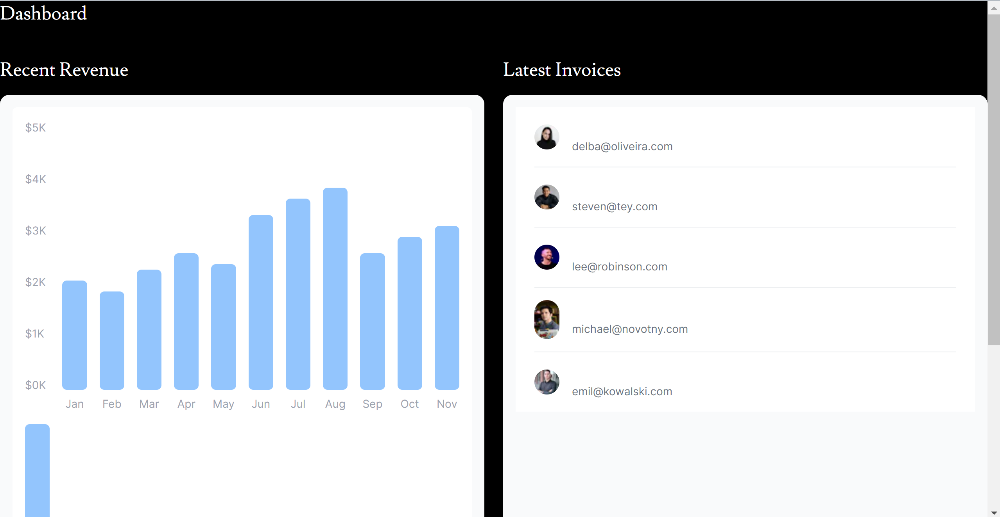
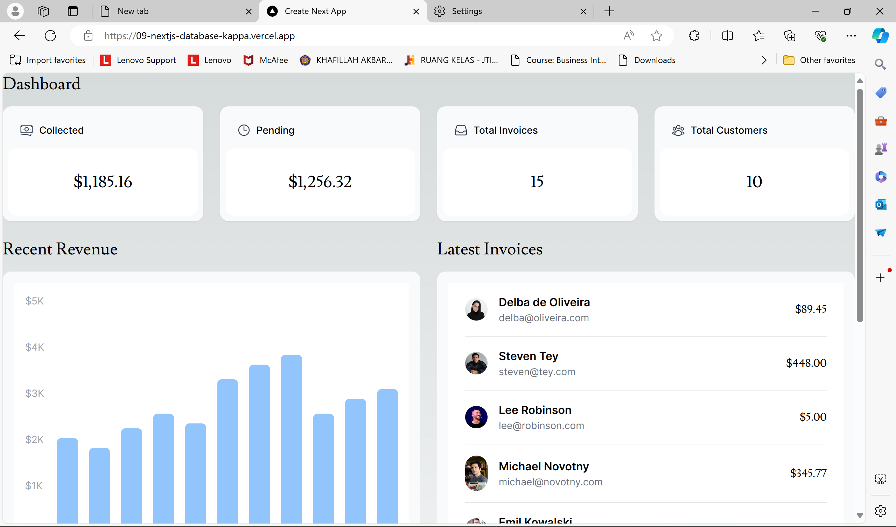
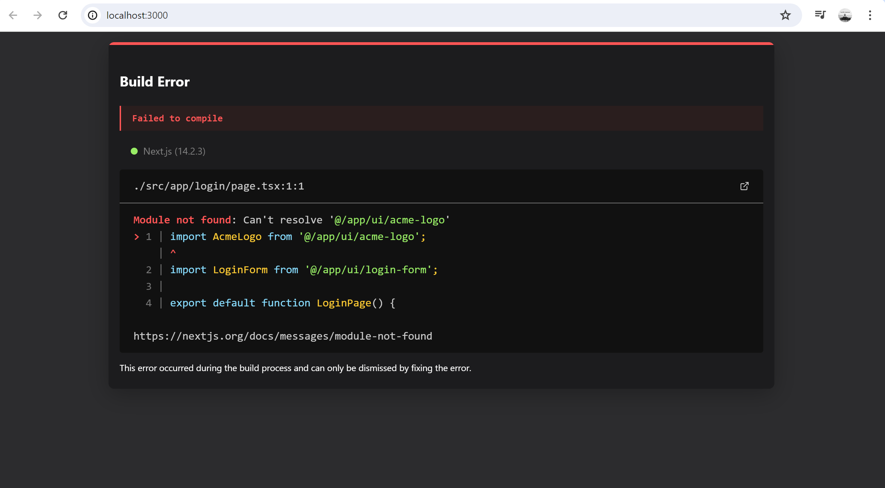

This is a [Next.js](https://nextjs.org/) project bootstrapped with [`create-next-app`](https://github.com/vercel/next.js/tree/canary/packages/create-next-app).

## Getting Started

First, run the development server:

```bash
npm run dev
# or
yarn dev
# or
pnpm dev
# or
bun dev
```

Open [http://localhost:3000](http://localhost:3000) with your browser to see the result.

You can start editing the page by modifying `app/page.tsx`. The page auto-updates as you edit the file.

This project uses [`next/font`](https://nextjs.org/docs/basic-features/font-optimization) to automatically optimize and load Inter, a custom Google Font.

|  | Pemrograman Berbasis Framework 2024 |
|--|--|
| NIM |  2141720152|
| Nama |  Khafillah Akbar Syahputra |
| Kelas | TI - 3I |


### Jawaban Soal 1


### Jawaban Soal 2

- Vercell merupakan aplikasi yang bisa digunakan untuk menghosting website dari next.js

### Jawaban Soal 3


### Jawaban Soal 4


### Jawaban Soal 5


- Pada saat terjadi perubahan dan kita melakukan push, vercell akan otomatis mengubah dan mendeployment ulang
- Link : https://09-nextjs-database-kappa.vercel.app/

### Jawaban Soal 6


### Jawaban Soal 7

- Query dapat dilakukan pada file tsx yang bisa dikombinasikan agar hasil query dapat ditampilkan serta mengambil data.

### Jawaban Soal Praktikum


Fungsi fetchCardData() pada query.tsx adalah untuk mengambil data user yang akan ditampilkan pada dashboard aplikasi. Data yang diambil antara lain adalah  jumlah total invoice, jumlah total pelanggan, total jumlah invoice yang telah dibayar, total jumlah invoice yang masih pending.


## Week 10
### Jawaban Soal 1

- Terdapat error seperti gambar diatas 


